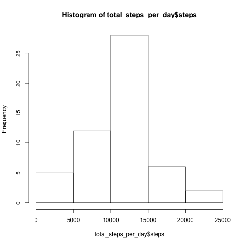
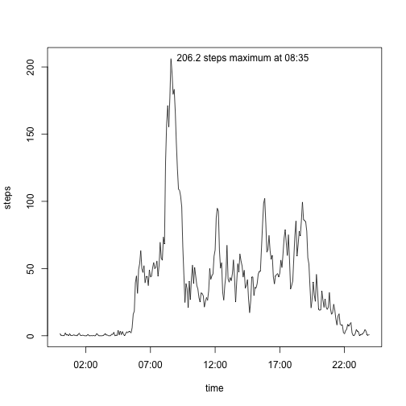
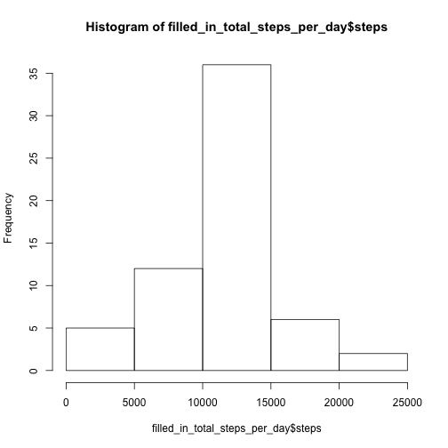
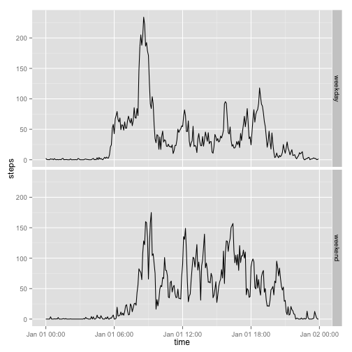

## Loading and preprocessing the data


```r
library(stringi)
library(lubridate)
library(ggplot2)
if (!file.exists("activity.csv")) unzip("activity.zip")
activity <- read.csv("activity.csv", colClasses = c("integer", "Date", "character"))
activity$time <- parse_date_time(stri_pad_left(activity$interval, 4, 0), "hm")
str(activity)
```

```
## 'data.frame':	17568 obs. of  4 variables:
##  $ steps   : int  NA NA NA NA NA NA NA NA NA NA ...
##  $ date    : Date, format: "2012-10-01" "2012-10-01" ...
##  $ interval: chr  "0" "5" "10" "15" ...
##  $ time    : POSIXct, format: "0000-01-01 00:00:00" "0000-01-01 00:05:00" ...
```

## What is mean total number of steps taken per day?


```r
total_steps_per_day <- aggregate(steps ~ date, activity, sum)
hist(total_steps_per_day$steps)
```

 

### Calculating the mean and median


```r
mean(total_steps_per_day$steps)
```

```
## [1] 10766.19
```

```r
median(total_steps_per_day$steps)
```

```
## [1] 10765
```

## What is the average daily activity pattern?


```r
mean_steps_per_interval <- aggregate(steps ~ time, activity, mean)
```

### Calculating which 5-minute interval has the maximum of the mean steps


```r
max_steps <- mean_steps_per_interval[which.max(mean_steps_per_interval$steps),]
max_label <- paste(round(max_steps$steps, 1),
                   "steps maximum at", format(max_steps$time, "%H:%M"))
max_label
```

```
## [1] "206.2 steps maximum at 08:35"
```

### Plotting the mean steps for each 5-minute interval


```r
with(mean_steps_per_interval, {
  plot(time, steps, type = "l")
  text(max_steps, max_label, pos = 4)
})
```

 

## Imputing missing values

### Calculating the total number of rows with missing values


```r
steps <- activity$steps
sum(is.na(steps))
```

```
## [1] 2304
```

### Filling in missing values with the mean for the 5-minute interval


```r
for (i in which(is.na(steps))) {
  steps[i] <- subset(mean_steps_per_interval, time == activity$time[i])$steps
}
filled_in_total_steps_per_day <- aggregate(steps ~ date,
                                           cbind(steps, subset(activity, select = 'date')), sum)
hist(filled_in_total_steps_per_day$steps)
```

 

### Mean and median with the missing values filled in


```r
mean(filled_in_total_steps_per_day$steps)
```

```
## [1] 10766.19
```

```r
median(filled_in_total_steps_per_day$steps)
```

```
## [1] 10766.19
```

Using the means of the 5-minute intervals to fill in missing values did not affect the mean total steps per day, but it increased the median so that it became equal to the mean.

## Are there differences in activity patterns between weekdays and weekends?

### Assigning a factor to each observation identifying weekdays and weekends


```r
weekpart <- rep("weekday", length(activity$date))
weekpart[which(weekdays(activity$date) %in% c("Saturday", "Sunday"))] <- "weekend"
activity$weekpart <- as.factor(weekpart)
```

### Plotting the average daily activity for weekdays and weekends


```r
qplot(time, steps, geom = "line", facets = weekpart ~ .,
      data = aggregate(steps ~ time + weekpart, activity, mean))
```

 

The weekday and weekend activity patterns appear similar, but more steps were taken in the morning on weekdays, whereas more steps were taken later in the day on weekends.
